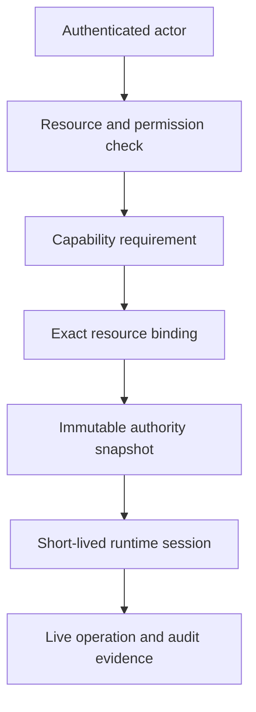

# Authorization workflow

Hephaestus authorization narrows authority as work moves from an authenticated
actor to a concrete runtime operation. Request authorization first evaluates a
typed subject, resource, and permission. A release then declares capability
requirements, an instance binds each selected slot to an exact resource, and
the resulting snapshot becomes the runtime's immutable ceiling.

At dispatch, `runtime-authority` issues one short-lived session and hands its
bearer to trusted bootstrap code. The runtime and Git authority layers retain
hashes and exact session or scope identities, while transports recheck live
expiry and revocation before accepting an operation. Capability decisions and
uses are recorded by `capability-audit` against the same snapshot and binding
so operators can explain what was allowed and what happened.

The flow is:

Use the authorization crates at their corresponding boundaries: domain values
define the ceiling, application ports issue and authenticate authority, and
provider adapters persist records or evaluate current policy.
