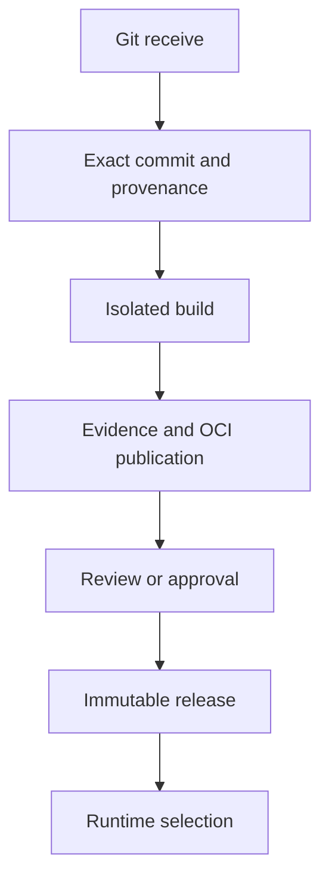

# Purpose

Forge carries source from an accepted Git receive to a reviewed, immutable
release that a runtime can execute. It gives the rest of Hephaestus durable
project and repository meaning, exact receive provenance, isolated build
contracts, review controls, and OCI publication records.

# Responsibilities

The normal workflow starts with a validated repository update. Forge records
the receive, derives idempotent build and run requests, builds from the exact
commit, and records the artifacts and supply-chain evidence needed to publish
an immutable release. Review controls can then approve a result with a
compare-and-swap Git update, while release and registry records preserve the
source, configuration, artifact, and policy provenance used by a later run.

The core crates define these decisions and ports. Git capability rules bound
refs, changed paths, transfer sizes, and mutation policy; registry records
bind namespaces to owners and require verified immutable publications; PAT and
review flows keep bearer or control authority scoped and auditable. Concrete
Git, PostgreSQL, NATS, OCI, and process adapters implement the ports in the
standard workspace.

# When

Use Forge when an accepted repository update should become durable work and,
later, when a project selects a published release. The high-level path is:

Start with `forge-domain` values and `forge-service` receive ports; use the
build, registry, review, and release crates at the corresponding workflow
stage.
