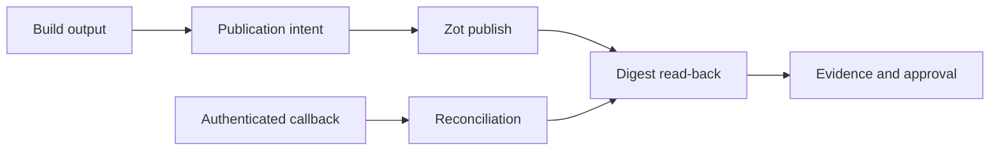

# Registry workflow

Forge treats the OCI registry as the content store and keeps ownership,
publication intent, verification, and approval in its own durable records.
Build workers create a publication intent for an expected manifest, publish
content, read it back by immutable digest, attach supply-chain evidence, and
approve the intent only when those values match.

Zot callbacks enter through `registry-notification` as authenticated,
idempotent observations. `registry-reconciler` reads Zot again and emits an
action; `registry-domain` supplies namespace ownership, publication lifecycle,
inventory, and retention decisions; `registry-token` signs narrowly scoped
bearer tokens after live authorization.

The registry path is:

