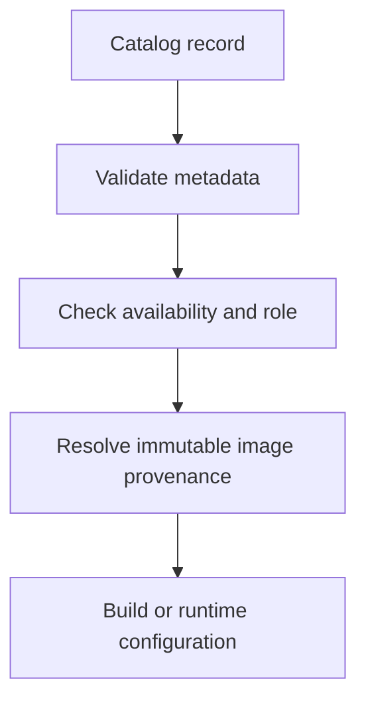

# Image core

Image gives build and runtime workflows one reviewed catalog of OCI images.
The catalog records a stable key, immutable reference, digest-related
provenance, supported architectures, toolchains, availability, and the policy
version that approved the record. A caller can therefore resolve the same
image choice later without turning a mutable tag into execution input.

## How image selection works

The [`domain/`](domain/) crate validates catalog values and models publication
evidence. [`application/`](application/) reads those values through ports,
rejects invalid projections, and resolves a selected key or immutable reference
to `ResolvedImage`. Registry publication state is projected separately so
operators can see pending, verified, approved, missing, and retired evidence.

The resolved image carries only image identity and policy provenance. The
caller still supplies the run's resource, network, secret, mount, and guest
authority decisions. This keeps an approved image choice from silently
becoming permission to use other host capabilities.

The PostgreSQL adapter is under [`heph-std/image/postgres/`](../../heph-std/image/postgres/),
while Forge owns image builds and registry publication workers. The
composition root wires those adapters into RPC, build, and run flows. See
[`docs/repository-image-builds.md`](../../../docs/repository-image-builds.md)
for the repository-image workflow.
