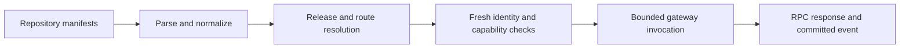

# Platform core

Platform connects repository declarations, authenticated callers, gateway
requests, and the transport layer. It supplies the stable identifiers and
validation rules that let Forge, Image, Runtime, and the control plane agree on
the same installation, revision, route, event, and request without sharing
provider implementation details.

## The platform workflow

[`agent-config/`](agent-config/) parses a versioned repository manifest and
normalizes its build, guest, capability, gateway, UI, parameter, secret-slot,
and result declarations. [`gateway/`](gateway/) turns an approved declaration
into bounded route and invocation contracts. An authenticated edge resolves the
current route and revision, validates the request, strips credential-bearing
browser headers where required, and forwards a bounded request to the selected
guest. [`event/`](event/) provides mutation receipts and committed outbox
ports, while [`rpc-proto/`](rpc-proto/) defines the wire messages and Connect
service contracts. [`runtime-types/`](runtime-types/) keeps IDs stable across
these workflows.

The platform contracts keep declaration, authorization, and invocation as
separate steps. A route is selected from the current immutable revision, and
the edge rechecks authority at the durable boundary before dispatch. Generated
RPC values stay at the transport boundary; application and domain code use
their own models.

Concrete gateway, database, event, and daemon composition lives in
[`heph-std/`](../../heph-std/) and [`heph-app`](../../heph-app/). See
[`docs/persistent-gateway-services.md`](../../../docs/persistent-gateway-services.md),
[`docs/authorization.md`](../../../docs/authorization.md), and
[`docs/application.md`](../../../docs/application.md).
