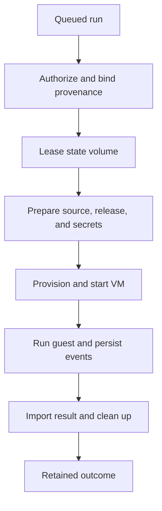

# Purpose

Runtime turns an accepted release and revision into one bounded guest
execution. It coordinates the run state machine, VM lifecycle, optional
instance state, exact source workspaces, result publication, and mailbox
delivery. The core contracts let the application compose these steps while
keeping host storage, VM providers, and brokers behind their own adapters.

# Responsibilities

The run starts with immutable release and repository provenance. The
orchestrator validates live authority, acquires an exclusive volume lease when
state is required, prepares the exact source and release mounts, and builds a
VM specification. After the VM reports readiness, bounded events and logs are
persisted while the guest runs. Completion records the outcome, imports only
the approved result, and releases the VM and lease. Recovery fences stale
leases and cleans abandoned resources before they can be reused.

The main seams are [`run/`](run/) for durable commands and orchestration,
[`vm/trait/`](vm/trait/) for guest lifecycle, [`volume/trait/`](volume/trait/)
for exclusive persistent state, [`workspace/domain/`](workspace/domain/) for
source and result lifecycles, and [`mailbox/`](mailbox/) for bounded event
delivery. [`src/`](src/) re-exports the stable VM, volume, and workspace
contracts used by composition code.

Each guest receives an immutable release tree and exact source input. Writable
state and result paths are separate, and host-side authority checks happen
before materialization and again before provisioning. Mailbox bodies remain
opaque to the control plane and enter a guest only through an accepted,
bounded dispatch record.

# When

Use the runtime contracts from application composition after the exact release,
revision, and launch authority have been resolved. Concrete adapters and
composition live in [`heph-std/runtime/`](../../heph-std/runtime/),
[`heph-std/run/`](../../heph-std/run/), and [`heph-app`](../../heph-app/). See
[`docs/vm-runtime.md`](../../../docs/vm-runtime.md),
[`docs/run-orchestration.md`](../../../docs/run-orchestration.md), and
[`docs/application.md`](../../../docs/application.md) for operational detail.
