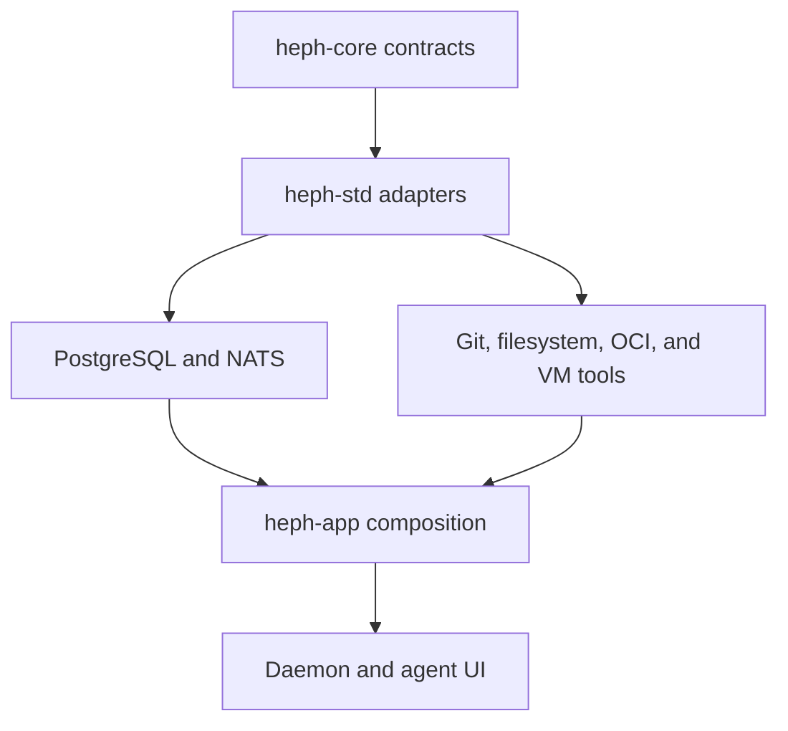

# Hephaestus standard implementations

`crates/heph-std/` adapts the portable contracts in
[`heph-core`](../heph-core/) to the host, database, transport, and toolchain
available in a Heph distribution. The core owns domain meaning and lifecycle
ports; standard providers perform the effects and return typed outcomes that
the composition root can supervise.

## Provider workflow

[`forge/`](forge/) handles exact Git receives, builds, immutable releases,
registry evidence, and human-controlled result publication. [`runtime/`](runtime/)
and [`run/`](run/) provide VM, volume, workspace, mailbox, command transport,
and per-run materialization adapters. [`gateway/`](gateway/) reconciles the
private edge, while [`identity/`](identity/), [`authorization/`](authorization/),
and [`secret/`](secret/) connect authenticated requests and bounded host-to-VM
authority to concrete providers.

The same core ports can use deterministic adapters such as the fake VM in
tests or host integrations such as libkrun, PostgreSQL, NATS, Caddy, and local
Git. Providers keep path, credential, authority, provenance, and cleanup checks
at their effect boundary; `heph-app` selects them, applies configuration, and
owns startup and shutdown sequencing. This keeps the core portable while the
distribution still produces durable, observable work.

See [`docs/application.md`](../../docs/application.md) for composition and
[`docs/vm-runtime.md`](../../docs/vm-runtime.md) for the VM provider contract.
