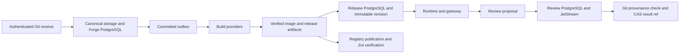

# Forge providers

The Forge providers carry a repository change from authenticated receive to an
immutable, runnable result. The portable core defines the receive, build,
release, registry, and review contracts; these adapters connect those contracts
to canonical bare Git, PostgreSQL, NATS, local build tools, OCI registries, and
trusted Git publication.

`[git-http/](git-http/)` authenticates human, PAT, and runtime-Git traffic,
validates the quarantined receive, and hands the exact commit to
[`storage/`](storage/) and [`postgres/`](postgres/). The Forge outbox and
[`nats/`](nats/) publish committed build and run commands. The
[`build/`](build/) providers check out that exact revision, create and verify
OCI material, and hand immutable evidence to [`release/`](release/), where
[`artifact-store/`](release/artifact-store/) and its PostgreSQL adapter record
the release, capabilities, attachments, and update lifecycle.

The [`registry/`](registry/) providers publish or inspect digest-pinned OCI
content and its SBOM, provenance, scan, and signature evidence. The
[`review/`](review/) providers persist human controls, deliver them through
JetStream, and allow Git result publication only when the recorded result is a
child of the exact input commit and the target ref still has that input.

Across these workflows, PostgreSQL adapters commit state and outbox effects
together, workers consume commands emitted from committed outbox rows, and
each host adapter rechecks paths, authority, digest, or ref provenance at its
boundary. A caller therefore receives a durable receive, verified build or
publication evidence, an immutable release revision, or an explicit review
conflict that can be reconciled.
