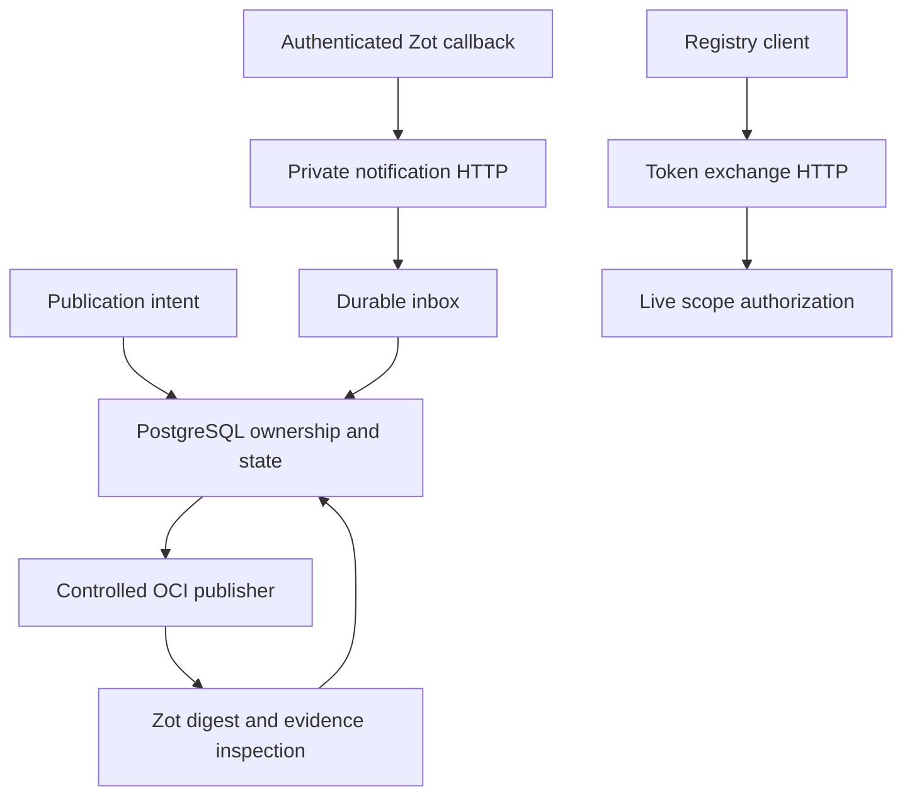

# Registry providers

The registry providers turn Forge's provider-neutral OCI publication contracts
into authenticated HTTP, PostgreSQL, local publication, and Zot inspection
workflows. They share one lifecycle: a publication intent is persisted, an
administrator-controlled publisher creates or verifies content, Zot callbacks
enter a durable inbox, and reconciliation records whether the exact digest and
required supply-chain evidence are available.

- [`http/`](http/) issues short-lived bearer tokens after live scope
  authorization.
- [`notification-http/`](notification-http/) authenticates and bounds Zot
  CloudEvents before idempotent inbox insertion.
- [`postgres/`](postgres/) owns registry control-plane rows, notification
  claims, transitions, and evidence projections.
- [`publisher/`](publisher/) imports approved local OCI layouts and verifies
  the configured remote.
- [`zot/`](zot/) reads exact digests, platforms, and referrers from the
  administrator-configured Zot authority.

The result is a catalog state that callers can trust as an immutable digest
with explicit publication and evidence status. Registry credentials,
administrator origins, callback credentials, and tenant authorization stay at
their respective boundaries.
