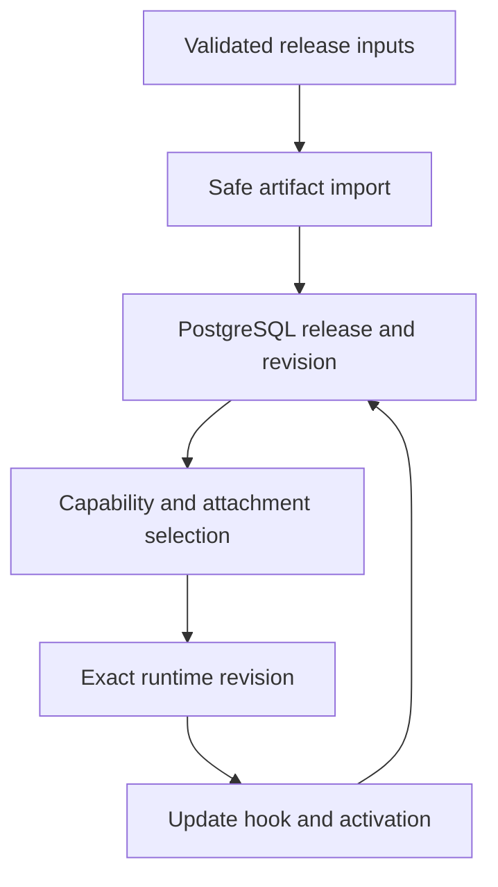

# Release providers

The release providers connect release and instance contracts to durable
PostgreSQL state and safe host artifact storage. A build produces a sealed
output tree, while a repository receive supplies the exact source revision that
the build consumes. The artifact store imports the sealed output into
immutable opaque objects, and the PostgreSQL adapter records the release,
revision, capability bindings, attachments, updates, UI installation state, and
command events that make an exact run possible.

- [`artifact-store/`](artifact-store/) validates and hashes sealed output
  trees, then stores files under opaque immutable identities.
- [`postgres/`](postgres/) performs authorized release, instance, capability,
  attachment, update, UI, and event transactions.

Callers receive an immutable release or revision with exact provenance and
policy bindings. Authorization is checked in the transaction that reads or
changes durable state, and recovery records uncertain update or publication
outcomes for later reconciliation.
