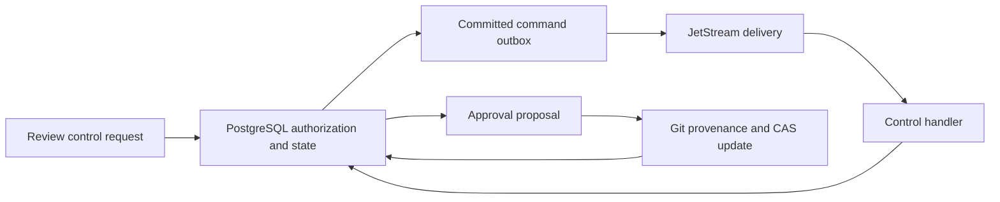

# Review providers

The review providers persist human control requests, publish them through
JetStream, and apply approved result decisions to canonical Git while recording
rejected decisions durably. They connect the browser review surface to durable
run cancellation, retry, result rejection, and compare-and-swap approval
workflows.

- [`postgres/`](postgres/) applies authorization, control state transitions,
  run events, and outbox writes in PostgreSQL transactions.
- [`nats/`](nats/) claims committed commands, publishes with message
  deduplication, and acknowledges only after durable handling.
- [`git/`](git/) verifies the recorded result commit and updates the target ref
  only when it still points at the recorded input commit.

The caller receives a durable completed, denied, rejected, conflicted, or
already-completed outcome. Review approval is therefore a controlled Git
publication decision rather than an unchecked browser write.
