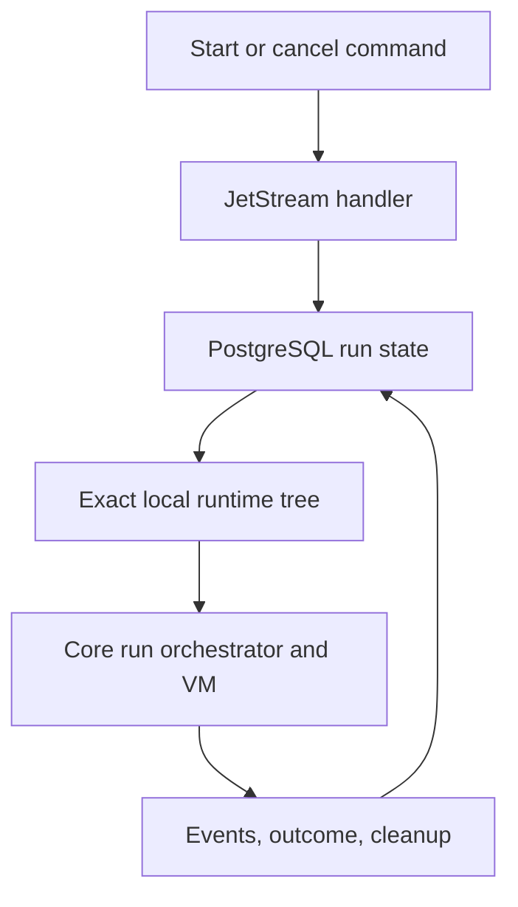

# Run providers

The run providers deliver durable run commands, persistence, and exact runtime
materialization. [`postgres/`](postgres/) stores the run state machine,
provenance, resource bindings, and ordered VM events. [`nats/`](nats/) carries
start and cancellation commands through JetStream. [`runtime-local/`](runtime-local/)
builds the sealed `/release` and `/run/hephaestus` trees consumed by a VM.

The caller receives a committed run transition, a redeliverable command
failure, or an exact set of read-only mounts. PostgreSQL remains authoritative
for provenance and transitions; local materialization verifies opaque artifact
objects and removes staging trees after failures.
