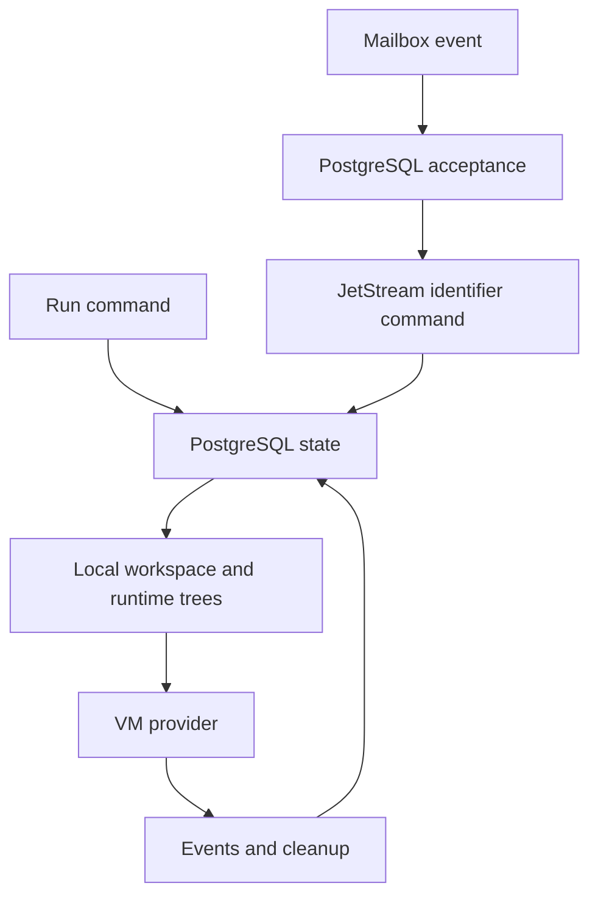

# Runtime providers

The runtime providers turn the core VM, volume, workspace, and mailbox ports
into host and database effects. They are assembled by the daemon around one
run orchestrator: PostgreSQL records durable ownership and lifecycle, local
adapters materialize files or disks, and transport workers deliver commands.

- [`vm/`](vm/) contains the deterministic test provider and the Linux
  libkrun provider.
- [`volume/`](volume/) pairs raw single-host backing files with PostgreSQL
  lease metadata and fencing.
- [`workspace/`](workspace/) persists lifecycle records and performs safe
  exact-commit Git and result operations.
- [`mailbox/`](mailbox/) accepts opaque events in PostgreSQL and dispatches
  identifier-only commands through JetStream.

The caller receives provider-neutral lifecycle outcomes, verified mounts,
fenced leases, or durable recovery state. Each provider keeps path, credential,
authority, and cleanup checks at the boundary where it can enforce them.
